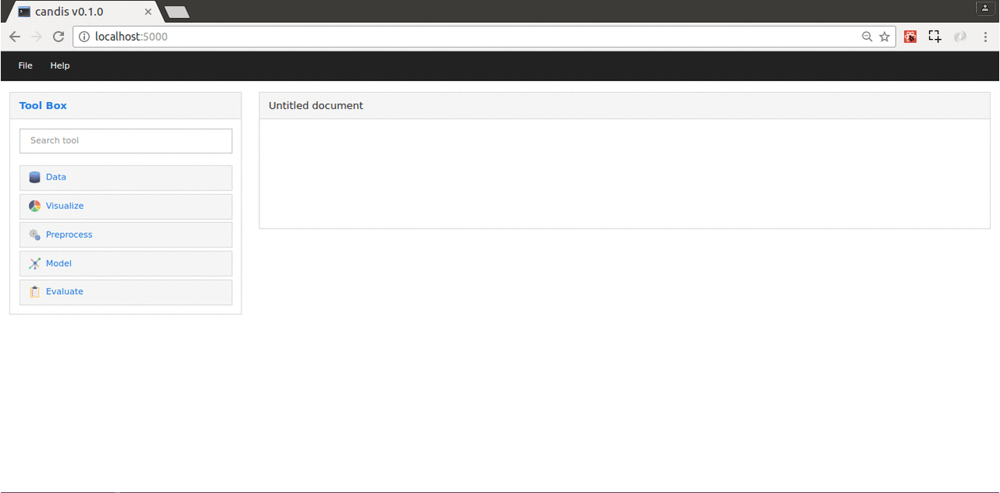

<div align="center">
  
</div>

---

<h4 align="center">
  A data mining suite for DNA microarrays
</h4>

<p align="center">
  <a href="http://candis.readthedocs.io">
    
  </a>
  <a href="https://saythanks.io/to/achillesrasquinha">
    
  </a>
  <a href="https://paypal.me/achillesrasquinha">
    
  </a>
</p>



**candis** is an open source data mining suite (released under the [GNU General Public License v3](LICENSE)) for DNA microarrays that consists of a wide collection of tools you require, right from Data Extraction to Model Deployment. **candis** is built on top of the toolkit - [CancerDiscover](http://github.com/HelikarLab/CancerDiscover) written by the bioinformaticians at [HelikarLab](helikarlab.org).

***WARNING***: candis currently is still in `dev` mode and not production-ready yet. In case if you run across bugs or errors, raise an issue over [here](https://github.com/achillesrasquinha/candis/issues).

### Table of Contents
* [Installation](#installation)
* [Usage](#usage)
* [Features](#features)
* [Dependencies](#dependencies)
* [License](#license)

### Installation
To install candis right from scratch, check out our exhaustive guides:
* [A Hitchhiker's Guide to Installing candis on Mac OS X](https://github.com/achillesrasquinha/candis/wiki/A-Hitchhiker's-Guide-to-Installing-candis-on-Mac-OS-X)
* [A Hitchhiker's Guide to Installing candis on Linux OS](https://github.com/achillesrasquinha/candis/wiki/A-Hitchhiker's-Guide-to-Installing-candis-on-Linux-OS) (In Progress)
* [A Hitchhiker's Guide to Installing candis on Windows OS](https://github.com/achillesrasquinha/candis/wiki/A-Hitchhiker's-Guide-to-Installing-candis-on-Windows-OS) (Contributors Wanted)

### Usage
**Launching the RIA (Rich Internet Application)**

via CLI
```
$ candis
```
OR
```
$ python -m candis
```

via Python
```python
>>> import candis
>>> candis.main()
```

**Using the CLI (Command Line Interface)**

```
$ candis --cdata path/to/data.cdata --config path/to/config.json
```

### Features
* Converting a CDATA to an **ARFF** file

  ```python
  >>> import candis
  >>> cdata = candis.cdata.read('path/to/data.cdata')
  ```

  Then, simply use the `CData.toARFF` API:

  ```python
  >>> cdata.toARFF('path/to/data.arff')
  ```

* Running a `Pipeline`.
  ```python
  >>> pipe = candis.Pipeline()
  >>> pipe.run(cdata)
  >>> while pipe.status == candis.Pipeline.RUNNING:
  ...     # do something while pipeline is running
  ```

### Dependencies
* Production Dependencies
  * R
  * WEKA (***NOTE:*** Requires Java)
  * Python 3.6+ and [PIP](https://pip.pypa.io) (Python's Package Manager)
* Development Dependencies
  * [Node.js](https://nodejs.org)
  * [SASS](http://sass-lang.com)

### License
This software has been released under the [GNU General Public License v3](LICENSE).
