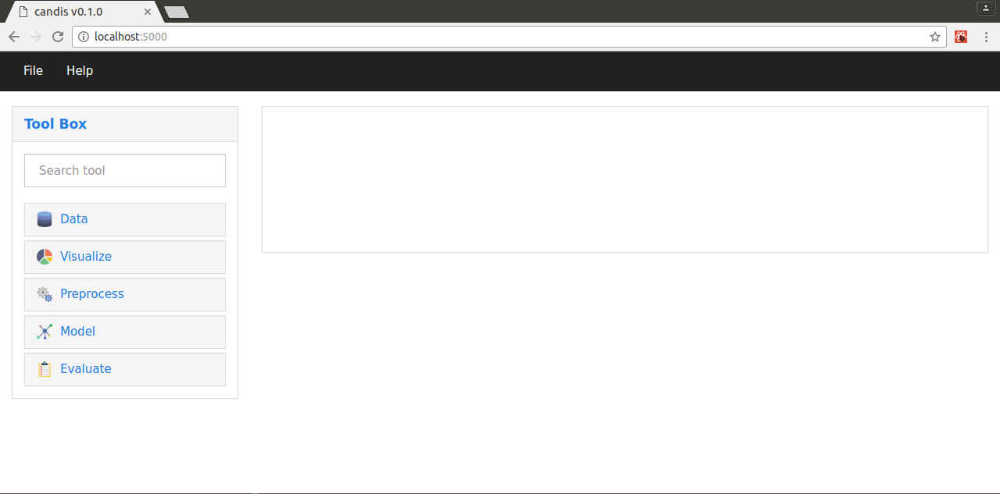

> :ribbon: *"A data mining suite for DNA microarrays."*

### Table of Contents
* [Installation](#installation)
* [Usage](#usage)
* [Dependencies](#dependencies)
* [License](#license)

### Installation
Download or clone the repository as follows:
```console
$ git clone http://github.com/achillesrasquinha/candis.git && cd candis
```

Install necessary dependencies:
```console
$ make install
```

### Usage
**Launching the RIA (Rich Internet Application)**

via CLI
```
$ candis
```
OR
```
$ python -m candis
```

via Python
```python
>>> import candis
>>> candis.main()
```



### Dependencies
* Production Dependencies
  * Python 2.7+ or Python 3.5+
* Development Dependencies
  * [Node.js](https://nodejs.org)
  * [SASS](http://sass-lang.com)

### License
This software has been released under the [GNU General Public License v3](LICENSE).
